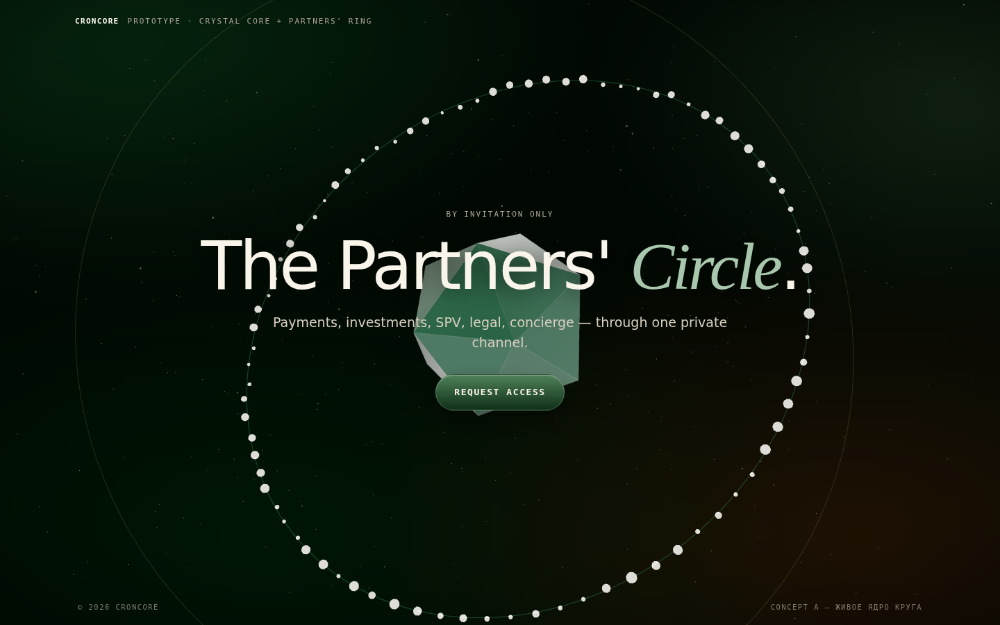

# CRONCORE — предложения по анимации и 3D для лендинга

Калибровка по референсам: [hubtown.co.in](https://hubtown.co.in/) · [showcase.noomoagency.com](https://showcase.noomoagency.com/) · [futureoffinance.peachweb.io](https://futureoffinance.peachweb.io/) · [cipherdigital.com](https://cipherdigital.com/)

**В папке уже лежит рабочий прототип рекомендуемого концепта** — см. [Концепт A](#концепт-a--хрустальное-ядро--кольцо-партнёров-прототип-готов) и `demo-core.html`.



---

## 1. Что уже есть на лендинге

Текущий `index.html` — одноэкранный «слайд» без скролла, и он уже неплохо анимирован:

- прелоадер с glitch-reveal вордмарка и прогресс-баром;
- аврора-фоны (два дрейфующих цветовых поля) + зерно;
- разлёт/схождение букв H1 (converge), каскадные entrance-реветы;
- кастомный курсор (точка + кольцо), spotlight за курсором;
- glitch + pixel-кнопки CTA;
- всё аккуратно гейтится `prefers-reduced-motion` и `pointer: fine`.

Чего нет по сравнению с референсами: **ни одного настоящего 3D/WebGL-элемента**, глубины сцены и «вау-объекта», вокруг которого строится композиция. При этом в репозитории уже есть серьёзная 3D-база: `game/` — React Three Fiber + WebGPU (three 0.182, drei, postprocessing, GSAP), готовые ассеты (роза с VAT-анимацией `game/public/vat/Rose.glb`, астронавт, звёздное небо, трава, cosmic beams). Это сильно снижает стоимость любого из концептов ниже.

## 2. Что общего у референсов (наш целевой уровень)

1. **Один герой-объект в 3D** — стекло/хром/кристалл с преломлением и дисперсией, живущий за/над типографикой (Noomo, Future of Finance).
2. **Реакция на курсор** — параллакс камеры, магнитные кнопки, инерция.
3. **Кинематографичный прелоадер**, перетекающий в hero (у нас уже есть — нужно только «передать эстафету» 3D-сцене).
4. **Scroll-cinema** — камера летит по сцене, секции — «остановки» (Hubtown). Применимо, если решим уходить от одноэкранника.
5. **Пост-эффекты**: bloom, лёгкая хроматическая аберрация, зерно, виньетка.
6. **Безупречные фолбэки** — mobile/reduced-motion получают статичную, но красивую версию.

---

## 3. Концепты

### Концепт A — «Хрустальное ядро + Кольцо партнёров» *(прототип готов)*

**Метафора:** закрытый круг партнёров — буквально. Гранёный кристалл (ядро CRONCORE) с золотым «сердцем» внутри, вокруг — орбита из десятков светящихся узлов-партнёров, соединённых тонкой линией круга. Второе, тихое золотое кольцо — внешний контур сети.

- Кристалл: `MeshPhysicalMaterial` — transmission, iridescence, clearcoat, зелёное затухание в палитре forest; кремовая огранка по рёбрам.
- Узлы пульсируют в противофазе («сеть живёт»), кольцо медленно вращается.
- Параллакс: сцена и камера мягко тянутся за курсором (та же логика, что у текущего spotlight).
- Пыль-частицы в глубине вместо/поверх CSS-авроры.
- Идеально ложится на **текущий одноэкранный формат** — ничего не ломаем, канвас встаёт слоем между `.atmosphere` и `.slide`.

**Развитие после интеграции:** hover на CTA → узлы кольца ускоряются и стягиваются к ядру; отправка формы → вспышка ядра + новый узел встраивается в кольцо («вы в круге») — это фирменный момент, которого нет ни у одного референса.

**Референс-уровень:** Future of Finance / Noomo. **Сложность:** средняя. **Срок:** 2–4 дня на полную интеграцию с прелоадером и i18n.
**Прототип:** `proposals/demo-core.html` (чистый three.js, без сборки, вендоренный `vendor/three.module.min.js`).

### Концепт B — «Живой герб» (liquid-metal логотип)

**Метафора:** герб клуба, отлитый из жидкого металла. Логотип Croncore экструдируется в 3D (SVG → `ExtrudeGeometry`) или используется как маска для шейдера «жидкого хрома»: поверхность лениво течёт (curl noise), на hover — рябь от курсора, блики золота/леса.

- Заменяет статичный `hero-crest` — точечное, но очень заметное улучшение.
- Вершинный шейдер + matcap/env-отражение; на слабых устройствах — просто медленное вращение без нойза.
- Отлично сочетается с Концептом A (герб = ядро).

**Референс-уровень:** Noomo showcase (их хромовые объекты). **Сложность:** средняя (нужен чистый SVG-контур логотипа). **Срок:** 2–3 дня.

### Концепт C — «Вход в круг» (scroll-cinema, эволюция сайта)

**Метафора:** путь приглашённого. Лендинг перестаёт быть одноэкранником: Lenis (плавный скролл) + GSAP ScrollTrigger ведут камеру через одну непрерывную 3D-сцену:

1. **Врата** — прелоадер перетекает в полёт сквозь кольцо частиц;
2. **Пять направлений** — payments / invest / SPV / legal / concierge как пять кристаллов-спутников, камера облетает каждый, текст секций прилетает по сторонам;
3. **Ядро** — финальная остановка: кольцо партнёров из Концепта A и форма заявки.

- Единый `THREE.Scene`, камера по `CatmullRomCurve3`, прогресс = scroll offset.
- Можно переиспользовать `StarrySky`/частицы из `game/`, а розу (VAT `Rose.glb`) — как пасхалку в финале.
- Самый дорогой, но это уровень Hubtown «site of the day».

**Референс-уровень:** Hubtown. **Сложность:** высокая. **Срок:** 2–3 недели (включая контент пяти секций и полный i18n).

### Концепт D — «Сад за стеклом» (WebGPU-сцена из game/)

**Метафора:** закрытый сад — то, что скрыто за дверью клуба. Фоном hero становится живая сцена на базе уже готового кода `game/`: терраса с травой (GrassWebGPU), роза (VAT-анимация), звёздное небо. Всё за «матовым стеклом» (blur + виньетка), чтобы типографика оставалась главной; при наведении на CTA стекло на секунду «протирается» (blur спадает).

- Максимальное переиспользование: терраформ, трава, роза, небо уже написаны и оптимизированы (LOD, culling).
- Требует сборки (Vite + R3F) — лендинг перестаёт быть одним файлом; WebGPU-путь с фолбэком на WebGL.
- Самый необычный и «свой» вариант — такого нет ни у кого из референсов.

**Референс-уровень:** выше референсов по технологии (WebGPU), Noomo по подаче. **Сложность:** высокая (интеграция, вес ассетов, бюджет производительности). **Срок:** 1,5–2 недели.

---

## 4. Сквозные микро-анимации (к любому концепту)

| Приём | Что даёт | Стоимость |
|---|---|---|
| Магнитные кнопки (CTA тянется к курсору, текст — чуть сильнее) | фирменный приём всех четырёх референсов | ~0,5 дня |
| Инерционный курсор-кольцо (ring отстаёт от точки с lerp) | «дорогое» ощущение уже имеющегося курсора | ~0,5 дня |
| Scramble/decrypt-текст на hover пунктов (eyebrow, footer, язык) | поддерживает существующую glitch-эстетику | ~0,5 дня |
| Переход прелоадер → hero одним движением (счётчик «100%» улетает в eyebrow, вордмарк — в topbar, FLIP) | цельность, как у Hubtown | 1–2 дня |
| Тонкий пост-эффект поверх 3D: bloom + зерно + виньетка (заменяет CSS-зерно) | глубина и «киношность» | 1 день |
| Наклон/параллакс сцены от гироскопа на мобильных | оживляет touch-версию, где нет курсора | 0,5 дня |

## 5. Производительность и фолбэки (обязательная часть)

- `prefers-reduced-motion` → один статичный кадр 3D (уже так сделано в прототипе).
- Нет WebGL / слабый GPU (по `getContext` + эвристике DPR/ядер) → текущая CSS-аврора остаётся как есть: она и есть фолбэк.
- DPR клампится до 2; на мобильных — до 1,5; пауза рендера при `document.hidden` (в прототипе есть).
- Бюджет: ≤ 60 draw calls, ≤ 150k треугольников, ≤ 700 KB JS (three.module.min ≈ 350 KB gzip ≈ 115 KB).
- Шрифты/i18n/RTL не затрагиваются — 3D-слой не содержит текста.

## 6. Рекомендация и роадмап

**Этап 1 (сейчас):** Концепт A в прод — он усиливает существующий лендинг, не меняя его структуру, и закрывает главный разрыв с референсами (нет 3D-героя). Плюс магнитные кнопки и инерционный курсор из §4.

**Этап 2:** Концепт B — живой герб вместо статичного логотипа (и в topbar тоже), синхронизированный с ядром из A.

**Этап 3 (когда появится больше контента о направлениях):** эволюция в Концепт C — scroll-cinema; сцена из этапов 1–2 переиспользуется как финальная секция.

Концепт D держим как специальную акцию/пасхалку (например, страница «за дверью» после одобрения заявки — там уже есть игра).

## Как посмотреть прототип

```bash
# из корня репозитория
python3 serve.py            # или: python3 -m http.server 8000
# открыть http://localhost:8000/proposals/demo-core.html
```

Прототип самодостаточен (three.js вендорен в `proposals/vendor/`), работает без сборки и внешних CDN, уважает `prefers-reduced-motion`.
